# 🔐 OAuth 2.0 & SSO Complete Guide

> Deep Dive into Modern Authentication & Authorization for Enterprise Applications

**For:** Senior Engineers • Security Architects • Tech Leads • Solution Architects

**Tags:** `Security Focused` | `.NET Core Examples` | `Production Ready`

---

## 📋 Table of Contents

- [Overview](#-overview)
- [OAuth 2.0 Concepts](#-oauth-20-deep-dive)
- [OAuth 2.0 Flows](#-oauth-20-flow-diagrams)
- [SSO Concepts](#-single-sign-on-sso-deep-dive)
- [OpenID Connect & SAML](#-openid-connect--saml-20)
- [JWT & Tokens](#-jwt--token-deep-dive)
- [Architecture](#️-production-architecture)
- [.NET Core Implementation](#-net-core-implementation)
- [Security Best Practices](#️-security-best-practices)
- [Troubleshooting](#-troubleshooting-common-issues)
- [References](#-references--resources)

---

## 📋 Overview

This comprehensive guide covers OAuth 2.0 and Single Sign-On (SSO) authentication in depth, providing both conceptual understanding and practical implementation guidance. Designed for senior engineers with 5+ years of experience who need a deep understanding of modern authentication systems.

### Key Concepts at a Glance

| Concept | Description |
|---------|-------------|
| **OAuth 2.0** | Industry-standard protocol for authorization. Enables secure delegated access to resources without sharing credentials. |
| **Single Sign-On (SSO)** | Authentication scheme allowing users to access multiple applications with one set of credentials. |
| **OpenID Connect (OIDC)** | Identity layer built on OAuth 2.0. Adds authentication to OAuth's authorization capabilities. |
| **SAML 2.0** | XML-based standard for exchanging authentication and authorization data between parties. |

### Key Terminology

| Term | Description | Example |
|------|-------------|---------|
| **Resource Owner** | The user who owns the data and grants access | End user (you) |
| **Client** | Application requesting access to resources | Your web app, mobile app |
| **Authorization Server** | Issues tokens after authenticating the user | Azure AD, Auth0, Duende |
| **Resource Server** | Hosts protected resources (APIs) | Your backend API |
| **Identity Provider (IdP)** | Manages user identities and authentication | Okta, Azure AD, Google |
| **Service Provider (SP)** | Application that relies on IdP for authentication | Your application |
| **Access Token** | Credential used to access protected resources | JWT or opaque token |
| **Refresh Token** | Long-lived token used to obtain new access tokens | Stored securely server-side |
| **ID Token** | Contains user identity information (OIDC) | JWT with user claims |

---

## 🔑 OAuth 2.0 Deep Dive

OAuth 2.0 is an **authorization framework** (not authentication!) that enables applications to obtain limited access to user accounts on an HTTP service.

> 💡 **Important:** OAuth 2.0 is about **authorization** (what you can do), not authentication (who you are). OpenID Connect adds the authentication layer on top of OAuth 2.0.

### OAuth 2.0 Grant Types

#### 1. Authorization Code Grant (with PKCE) - ⭐ Recommended

**Best for:** Server-side web apps, SPAs, mobile apps  
**Security Level:** High (with PKCE)

**Flow Steps:**
1. **Authorization Request** - Client redirects user to auth server with client_id, redirect_uri, scope, state, and PKCE code_challenge
2. **User Authentication** - User authenticates and grants consent
3. **Authorization Code** - Auth server redirects back with code and state
4. **Token Exchange** - Client exchanges code for tokens using code_verifier
5. **Access Resource** - Client uses access token to call APIs

**PKCE (Proof Key for Code Exchange):**

```plaintext
// 1. Generate a random code_verifier (43-128 characters)
code_verifier = random_string(64)

// 2. Create code_challenge from code_verifier
code_challenge = BASE64URL(SHA256(code_verifier))

// 3. Send code_challenge in authorization request
GET /authorize?
  response_type=code&
  client_id=my-app&
  redirect_uri=https://app.example.com/callback&
  scope=openid profile&
  state=abc123&
  code_challenge=E9Melhoa2OwvFrEMTJguCHaoeK1t8URWbuGJSstw-cM&
  code_challenge_method=S256

// 4. Send code_verifier in token request
POST /token
  grant_type=authorization_code&
  code=AUTH_CODE&
  redirect_uri=https://app.example.com/callback&
  client_id=my-app&
  code_verifier=dBjftJeZ4CVP-mB92K27uhbUJU1p1r_wW1gFWFOEjXk
```

#### 2. Client Credentials Grant - Machine-to-Machine

**Best for:** Service-to-service communication, daemons, backend services  
**Security Level:** High (requires client secret)  
**No User Involved:** This flow is for applications acting on their own behalf.

```http
// Token Request
POST /token HTTP/1.1
Host: auth.example.com
Content-Type: application/x-www-form-urlencoded

grant_type=client_credentials&
client_id=backend-service&
client_secret=super-secret-key&
scope=api.read api.write

// Response
{
  "access_token": "eyJhbGciOiJSUzI1NiIsInR5...",
  "token_type": "Bearer",
  "expires_in": 3600,
  "scope": "api.read api.write"
}
```

> ⚠️ **Security Note:** Never expose client secrets in client-side code. Store them in secure configuration (Azure Key Vault, AWS Secrets Manager, etc.)

#### 3. Resource Owner Password Credentials (ROPC) - ⚠️ Legacy Only

**Best for:** Legacy applications, migration scenarios only  
**Security Level:** LOW - Avoid if possible

> 🚨 **Deprecated - Do Not Use:** ROPC is considered insecure and should only be used for migrating legacy applications. It exposes user credentials to the client application.

#### 4. Device Authorization Grant - IoT & Limited Input Devices

**Best for:** Smart TVs, IoT devices, CLI tools, devices without browsers  
**Security Level:** Medium-High

### Grant Types Comparison

| Grant Type | User Interaction | Client Type | Security | Use Case |
|------------|-----------------|-------------|----------|----------|
| Authorization Code + PKCE | Yes | Public/Confidential | ✅ High | Web apps, SPAs, Mobile |
| Client Credentials | No | Confidential only | ✅ High | Machine-to-machine |
| Device Code | Yes (separate device) | Public | Medium | IoT, Smart TV, CLI |
| ROPC | Yes (credentials) | Confidential | ❌ Low | Legacy migration only |
| Implicit (Deprecated) | Yes | Public | ❌ Low | Deprecated - use Auth Code + PKCE |

---

## 🔄 OAuth 2.0 Flow Diagrams

### Authorization Code Flow with PKCE

```mermaid
sequenceDiagram
    autonumber
    participant U as 👤 User
    participant B as 🌐 Browser
    participant C as 📱 Client App
    participant A as 🔐 Authorization Server
    participant R as 🗄️ Resource Server

    U->>B: Click "Login"
    B->>C: Initiate login
    C->>C: Generate code_verifier
    C->>C: code_challenge = SHA256(verifier)
    C->>B: Redirect to Auth Server
    B->>A: /authorize?response_type=code&code_challenge=xxx
    A->>B: Show login page
    U->>B: Enter credentials
    B->>A: Submit credentials
    A->>A: Validate user
    A->>B: Redirect with code
    B->>C: Deliver code
    C->>A: POST /token (code + code_verifier)
    A->>A: Validate verifier
    A->>C: access_token, refresh_token, id_token
    C->>R: GET /api (Bearer token)
    R->>R: Validate JWT
    R->>C: Protected data
```



---

## 🎫 Single Sign-On (SSO) Deep Dive

SSO is an **authentication scheme** that allows users to log in with a single ID to multiple related but independent software systems.

### How SSO Differs from OAuth 2.0

| Aspect | OAuth 2.0 | SSO |
|--------|----------|-----|
| Primary Purpose | Authorization (access delegation) | Authentication (identity verification) |
| Question Answered | "What can this app do on my behalf?" | "Who is this user?" |
| Session Management | Token-based, no central session | Central session at IdP |
| Logout | Revoke tokens per application | Single Logout (SLO) from all apps |
| User Experience | May prompt for each app | One login for all apps |

> 💡 **SSO + OAuth 2.0 = Best of Both Worlds:** In practice, SSO and OAuth 2.0 work together. OpenID Connect combines SSO (authentication) with OAuth 2.0 (authorization) to provide a complete solution.

### SSO Components

| Component | Description |
|-----------|-------------|
| **Identity Provider (IdP)** | Central authority that authenticates users. Examples: Azure AD, Okta, Auth0 |
| **Service Provider (SP)** | Applications that rely on the IdP for authentication |
| **Session Store** | Central storage for SSO session information |
| **Trust Relationship** | Pre-established trust between IdP and each SP |

### SSO Implementation Approaches

1. **Browser-Based SSO (Cookie-based)**
   - Uses browser cookies at the IdP domain
   - Simple but limited to browser apps
   - Third-party cookie restrictions apply

2. **Token-Based SSO (OIDC/OAuth)**
   - Uses tokens (JWTs) for cross-application authentication
   - Works across domains and supports mobile apps
   - Modern and flexible

3. **Enterprise SSO (SAML/Kerberos)**
   - For on-premises and hybrid scenarios
   - Common in enterprise environments

---

## 🔐 OpenID Connect & SAML 2.0

### OpenID Connect (OIDC)

OpenID Connect is an **identity layer built on top of OAuth 2.0**.

> 📝 **OIDC = OAuth 2.0 + Identity**
> - OAuth 2.0: "Give this app access to my photos" (authorization)
> - OpenID Connect: "This is who I am" (authentication) + OAuth 2.0 authorization

#### OIDC Key Concepts

| Concept | Description |
|---------|-------------|
| **ID Token** | JWT containing user identity claims (sub, name, email, etc.) |
| **UserInfo Endpoint** | /userinfo endpoint to fetch additional user claims |
| **Discovery** | /.well-known/openid-configuration for auto-configuration |
| **Scopes** | openid (required), profile, email, address, phone |
| **Claims** | User attributes: sub, name, email, picture, etc. |

#### OIDC Discovery Document

```json
// GET https://auth.example.com/.well-known/openid-configuration
{
  "issuer": "https://auth.example.com",
  "authorization_endpoint": "https://auth.example.com/authorize",
  "token_endpoint": "https://auth.example.com/token",
  "userinfo_endpoint": "https://auth.example.com/userinfo",
  "jwks_uri": "https://auth.example.com/.well-known/jwks.json",
  "end_session_endpoint": "https://auth.example.com/logout",
  "scopes_supported": ["openid", "profile", "email"],
  "response_types_supported": ["code", "token", "id_token"],
  "id_token_signing_alg_values_supported": ["RS256"]
}
```

### OIDC vs SAML Comparison

| Feature | OpenID Connect | SAML 2.0 |
|---------|---------------|----------|
| Data Format | JSON/JWT | XML |
| Transport | REST APIs (HTTP) | HTTP POST/Redirect, SOAP |
| Token Size | Compact (< 1KB typical) | Large (5-10KB+ common) |
| Mobile Support | ✅ Native | ❌ Challenging |
| SPA Support | ✅ Excellent | ❌ Limited |
| Enterprise Adoption | Growing rapidly | Widely established |
| Implementation | Simpler, modern SDKs | Complex, XML parsing |
| Best For | Modern apps, APIs, mobile | Legacy enterprise, B2B federation |

> ✅ **Recommendation:** Use OpenID Connect for new applications. Only use SAML when integrating with legacy enterprise systems.

---

## 📜 JWT & Token Deep Dive

### JSON Web Token (JWT) Structure

A JWT consists of three parts: `header.payload.signature`

```
eyJhbGciOiJSUzI1NiIsInR5cCI6IkpXVCJ9.eyJzdWIiOiJ1c2VyLTEyMyIsIm5hbWUiOiJKb2huIERvZSJ9.signature
```

#### Decoded JWT Example

```json
// HEADER
{
  "alg": "RS256",
  "typ": "JWT",
  "kid": "key-2024-01"
}

// PAYLOAD
{
  // Registered Claims (RFC 7519)
  "iss": "https://auth.example.com",  // Issuer
  "sub": "user-123-456",               // Subject (user ID)
  "aud": "https://api.example.com",    // Audience
  "exp": 1735689600,                   // Expiration
  "nbf": 1735686000,                   // Not Before
  "iat": 1735686000,                   // Issued At
  "jti": "unique-token-id-xyz",        // JWT ID

  // OpenID Connect Claims
  "name": "John Doe",
  "email": "john@example.com",
  "email_verified": true,

  // Custom Claims
  "roles": ["admin", "user"],
  "permissions": ["read:users", "write:users"],
  "tenant_id": "tenant-abc",
  "scope": "openid profile email api.read"
}

// SIGNATURE
RSASHA256(base64(header) + "." + base64(payload), privateKey)
```

### Token Types

| Token Type | Purpose | Lifetime | Storage |
|------------|---------|----------|---------|
| **Access Token** | Access protected resources (APIs) | Short (5-60 min) | Memory (SPA), HttpOnly cookie (server) |
| **Refresh Token** | Obtain new access tokens | Long (days to weeks) | Secure HttpOnly cookie, server-side only |
| **ID Token** | User identity information (OIDC) | Short (matches access token) | Used once for login, then discarded |

### Token Validation Steps

1. Parse JWT (split by '.')
2. Decode header (get 'kid' for key lookup)
3. Fetch JWKS (public keys from /.well-known/jwks.json)
4. Verify signature (RS256)
5. Check 'exp' claim (not expired)
6. Check 'nbf' claim (not before)
7. Validate 'iss' (trusted issuer)
8. Validate 'aud' (correct audience)
9. Check required scopes/roles

> ⚠️ **Token Storage Security:**
> - **Never** store tokens in localStorage (XSS vulnerable)
> - **SPAs:** Keep access token in memory only, use refresh token rotation
> - **Server apps:** Use HttpOnly, Secure, SameSite cookies
> - **Mobile:** Use secure storage (Keychain/Keystore)

---

## 🏗️ Production Architecture

### OAuth 2.0 + SSO Architecture Components

```
┌─────────────────────────────────────────────────────────────────┐
│                     IDENTITY LAYER                               │
│  ┌─────────────────────────────────────────────────────────┐    │
│  │              Identity Provider (IdP)                     │    │
│  │  ┌─────────┐  ┌─────────┐  ┌─────────┐  ┌─────────┐    │    │
│  │  │ User    │  │ Token   │  │ Session │  │ Consent │    │    │
│  │  │ Store   │  │ Service │  │ Manager │  │ Manager │    │    │
│  │  └─────────┘  └─────────┘  └─────────┘  └─────────┘    │    │
│  └─────────────────────────────────────────────────────────┘    │
└─────────────────────────────────────────────────────────────────┘
                              │
        ┌─────────────────────┼─────────────────────┐
        │                     │                     │
        ▼                     ▼                     ▼
┌───────────────┐     ┌───────────────┐     ┌───────────────┐
│   Web App     │     │  Mobile App   │     │  Backend API  │
│ (OIDC Client) │     │ (OIDC Client) │     │ (Resource)    │
└───────────────┘     └───────────────┘     └───────────────┘
```

### Component Responsibilities

| Component | Responsibility |
|-----------|---------------|
| **Identity Provider** | User authentication, token issuance, session management, consent handling |
| **Token Service** | JWT generation, signing, validation, refresh token management |
| **Session Manager** | SSO session state, single logout coordination |
| **API Gateway** | Token validation, rate limiting, routing, security policies |
| **Resource Server** | JWT validation, authorization enforcement, business logic |

---

## 💻 .NET Core Implementation

### 1. Duende IdentityServer Setup (Authorization Server)

```csharp
// Program.cs
var builder = WebApplication.CreateBuilder(args);

builder.Services.AddIdentityServer()
    .AddInMemoryClients(Config.Clients)
    .AddInMemoryIdentityResources(Config.IdentityResources)
    .AddInMemoryApiScopes(Config.ApiScopes)
    .AddTestUsers(TestUsers.Users)
    .AddDeveloperSigningCredential(); // Use AddSigningCredential in production

var app = builder.Build();
app.UseIdentityServer();
app.Run();
```

```csharp
// Config.cs - Client and Scope Configuration
public static class Config
{
    public static IEnumerable<IdentityResource> IdentityResources =>
        new List<IdentityResource>
        {
            new IdentityResources.OpenId(),
            new IdentityResources.Profile(),
            new IdentityResources.Email()
        };

    public static IEnumerable<ApiScope> ApiScopes =>
        new List<ApiScope>
        {
            new ApiScope("api.read", "Read access to API"),
            new ApiScope("api.write", "Write access to API")
        };

    public static IEnumerable<Client> Clients =>
        new List<Client>
        {
            // Web App (Authorization Code + PKCE)
            new Client
            {
                ClientId = "web-app",
                ClientName = "Web Application",
                AllowedGrantTypes = GrantTypes.Code,
                RequirePkce = true,
                RequireClientSecret = false, // Public client

                RedirectUris = { "https://app.example.com/callback" },
                PostLogoutRedirectUris = { "https://app.example.com/" },
                AllowedCorsOrigins = { "https://app.example.com" },

                AllowedScopes = { "openid", "profile", "email", "api.read" },
                AllowOfflineAccess = true, // Enable refresh tokens

                AccessTokenLifetime = 3600, // 1 hour
                RefreshTokenUsage = TokenUsage.OneTimeOnly,
                RefreshTokenExpiration = TokenExpiration.Sliding
            },

            // Machine-to-Machine (Client Credentials)
            new Client
            {
                ClientId = "backend-service",
                ClientSecrets = { new Secret("secret".Sha256()) },
                AllowedGrantTypes = GrantTypes.ClientCredentials,
                AllowedScopes = { "api.read", "api.write" }
            }
        };
}
```

### 2. Protected API with JWT Validation

```csharp
// Program.cs - API Project
var builder = WebApplication.CreateBuilder(args);

builder.Services.AddAuthentication("Bearer")
    .AddJwtBearer("Bearer", options =>
    {
        options.Authority = "https://auth.example.com";
        options.Audience = "api";

        options.TokenValidationParameters = new TokenValidationParameters
        {
            ValidateIssuer = true,
            ValidateAudience = true,
            ValidateLifetime = true,
            ValidateIssuerSigningKey = true,
            ClockSkew = TimeSpan.FromSeconds(30)
        };
    });

builder.Services.AddAuthorization(options =>
{
    options.AddPolicy("ReadAccess", policy =>
        policy.RequireClaim("scope", "api.read"));
    options.AddPolicy("WriteAccess", policy =>
        policy.RequireClaim("scope", "api.write"));
});

var app = builder.Build();
app.UseAuthentication();
app.UseAuthorization();
app.MapControllers();
app.Run();
```

```csharp
// UsersController.cs
[ApiController]
[Route("api/[controller]")]
[Authorize]
public class UsersController : ControllerBase
{
    [HttpGet]
    [Authorize(Policy = "ReadAccess")]
    public IActionResult GetUsers()
    {
        var userId = User.FindFirst("sub")?.Value;
        var scopes = User.FindFirst("scope")?.Value;

        return Ok(new { Message = "Protected data", UserId = userId });
    }

    [HttpPost]
    [Authorize(Policy = "WriteAccess")]
    public IActionResult CreateUser([FromBody] CreateUserDto dto)
    {
        return Created($"/api/users/{Guid.NewGuid()}", dto);
    }
}
```

### 3. OIDC Client Application

```csharp
// Program.cs - Web Application (OIDC Client)
var builder = WebApplication.CreateBuilder(args);

builder.Services.AddAuthentication(options =>
{
    options.DefaultScheme = CookieAuthenticationDefaults.AuthenticationScheme;
    options.DefaultChallengeScheme = OpenIdConnectDefaults.AuthenticationScheme;
})
.AddCookie(options =>
{
    options.Cookie.HttpOnly = true;
    options.Cookie.SecurePolicy = CookieSecurePolicy.Always;
    options.Cookie.SameSite = SameSiteMode.Lax;
})
.AddOpenIdConnect(options =>
{
    options.Authority = "https://auth.example.com";
    options.ClientId = "web-app";
    options.ResponseType = "code";
    options.UsePkce = true;

    options.Scope.Clear();
    options.Scope.Add("openid");
    options.Scope.Add("profile");
    options.Scope.Add("email");
    options.Scope.Add("api.read");
    options.Scope.Add("offline_access");

    options.SaveTokens = true; // Store tokens in authentication cookie
    options.GetClaimsFromUserInfoEndpoint = true;
});

var app = builder.Build();
app.UseAuthentication();
app.UseAuthorization();
app.MapControllerRoute("default", "{controller=Home}/{action=Index}/{id?}");
app.Run();
```

### 4. Azure AD Integration (Alternative)

```json
// appsettings.json
{
  "AzureAd": {
    "Instance": "https://login.microsoftonline.com/",
    "TenantId": "your-tenant-id",
    "ClientId": "your-client-id",
    "ClientSecret": "your-client-secret",
    "CallbackPath": "/signin-oidc"
  }
}
```

```csharp
// Program.cs - Azure AD with Microsoft.Identity.Web
using Microsoft.Identity.Web;

var builder = WebApplication.CreateBuilder(args);

builder.Services.AddAuthentication(OpenIdConnectDefaults.AuthenticationScheme)
    .AddMicrosoftIdentityWebApp(builder.Configuration.GetSection("AzureAd"))
    .EnableTokenAcquisitionToCallDownstreamApi()
    .AddDownstreamApi("MyApi", builder.Configuration.GetSection("DownstreamApi"))
    .AddInMemoryTokenCaches();

builder.Services.AddControllersWithViews()
    .AddMicrosoftIdentityUI();

var app = builder.Build();
app.UseAuthentication();
app.UseAuthorization();
app.MapControllers();
app.Run();
```

### 5. Token Refresh Handler

```csharp
public class TokenRefreshHandler : DelegatingHandler
{
    private readonly IHttpContextAccessor _httpContextAccessor;

    protected override async Task<HttpResponseMessage> SendAsync(
        HttpRequestMessage request,
        CancellationToken cancellationToken)
    {
        var context = _httpContextAccessor.HttpContext;
        var accessToken = await context.GetTokenAsync("access_token");
        var expiresAt = await context.GetTokenAsync("expires_at");

        // Check if token is about to expire (5 min buffer)
        if (DateTime.TryParse(expiresAt, out var expiry) &&
            expiry < DateTime.UtcNow.AddMinutes(5))
        {
            var refreshToken = await context.GetTokenAsync("refresh_token");

            if (!string.IsNullOrEmpty(refreshToken))
            {
                // Refresh the token (implementation depends on your IdP)
                var newTokens = await RefreshTokenAsync(refreshToken);

                // Update stored tokens
                var authInfo = await context.AuthenticateAsync();
                authInfo.Properties.UpdateTokenValue("access_token", newTokens.AccessToken);
                authInfo.Properties.UpdateTokenValue("refresh_token", newTokens.RefreshToken);
                authInfo.Properties.UpdateTokenValue("expires_at",
                    DateTime.UtcNow.AddSeconds(newTokens.ExpiresIn).ToString("o"));

                await context.SignInAsync(authInfo.Principal, authInfo.Properties);
                accessToken = newTokens.AccessToken;
            }
        }

        request.Headers.Authorization = new AuthenticationHeaderValue("Bearer", accessToken);
        return await base.SendAsync(request, cancellationToken);
    }
}
```

---

## 🛡️ Security Best Practices

### CSRF Protection - State Parameter

> 🚨 **Always Use the State Parameter** - The `state` parameter prevents CSRF attacks by binding the authorization request to the user's session.

```csharp
// Generate state parameter
var state = Convert.ToBase64String(RandomNumberGenerator.GetBytes(32));
HttpContext.Session.SetString("oauth_state", state);

// Include in authorization request
var authUrl = $"https://auth.example.com/authorize?" +
    $"response_type=code&" +
    $"client_id={clientId}&" +
    $"redirect_uri={redirectUri}&" +
    $"state={state}&" +  // Critical!
    $"code_challenge={codeChallenge}&" +
    $"code_challenge_method=S256";

// Validate state in callback
var expectedState = HttpContext.Session.GetString("oauth_state");
if (state != expectedState)
{
    throw new SecurityException("State mismatch - possible CSRF attack");
}
```

### XSS Prevention

| Attack Vector | Prevention |
|--------------|------------|
| Token stored in localStorage | Use HttpOnly cookies instead, or keep in memory only |
| Token in URL fragment | Use Authorization Code flow, not Implicit |
| Reflected token values | Always encode output, use CSP headers |

### Token Storage Guidelines

| Platform | Recommendation |
|----------|---------------|
| **Web Apps (Server)** | Encrypted HttpOnly cookies with Secure and SameSite flags |
| **SPAs** | Keep access token in memory only, use refresh token rotation, consider BFF pattern |
| **Mobile Apps** | Platform secure storage (iOS Keychain, Android Keystore) |

### Security Headers Configuration

```csharp
// Add security headers in Program.cs
app.Use(async (context, next) =>
{
    context.Response.Headers.Add("X-Content-Type-Options", "nosniff");
    context.Response.Headers.Add("X-Frame-Options", "DENY");
    context.Response.Headers.Add("X-XSS-Protection", "1; mode=block");
    context.Response.Headers.Add("Referrer-Policy", "strict-origin-when-cross-origin");
    context.Response.Headers.Add("Content-Security-Policy",
        "default-src 'self'; script-src 'self'; style-src 'self' 'unsafe-inline'");

    await next();
});
```

### Security Checklist

| Item | Status | Notes |
|------|--------|-------|
| Use HTTPS everywhere | ✓ | TLS 1.2+, HSTS enabled |
| PKCE for all OAuth flows | ✓ | Required for public clients |
| State parameter validation | ✓ | Prevents CSRF attacks |
| Token expiration validation | ✓ | Short-lived access tokens |
| Secure token storage | ✓ | HttpOnly cookies or memory |
| Refresh token rotation | ✓ | One-time use refresh tokens |
| Audience validation | ✓ | Validate 'aud' claim |
| Issuer validation | ✓ | Validate 'iss' claim |
| Clock skew handling | ✓ | Allow ~30 seconds skew |
| Audit logging | ✓ | Log all auth events |

---

## 🔧 Troubleshooting Common Issues

### 401 Unauthorized - Token Validation Failure

**Symptoms:** API returns 401 even with seemingly valid token

**Common Causes & Solutions:**

| Cause | Solution |
|-------|----------|
| Token expired | Check 'exp' claim, implement refresh logic |
| Wrong audience | Ensure 'aud' claim matches API's expected audience |
| Issuer mismatch | Verify 'iss' matches configured authority URL exactly |
| Clock skew | Sync server clocks, add ClockSkew tolerance |
| JWKS key rotation | Clear cached keys, verify JWKS endpoint accessible |

```bash
# Debug: Decode and inspect your token
# Visit https://jwt.io or use:
echo "YOUR_TOKEN" | cut -d'.' -f2 | base64 -d | jq
```

### CORS Errors with OAuth Endpoints

**Error:** `Access to fetch from origin 'https://spa.example.com' has been blocked by CORS policy`

**Solutions:**
1. Configure AllowedCorsOrigins on the client in IdentityServer
2. For SPAs, avoid calling /token directly - use the authorization code callback instead

```csharp
// In IdentityServer client configuration
new Client
{
    ClientId = "spa",
    AllowedCorsOrigins = { "https://spa.example.com" }, // Add your SPA origin
}
```

### State Mismatch / Invalid State Error

**Causes:**
- User opened multiple login tabs
- Session expired during authentication
- Cookie blocked by browser settings
- Load balancer sticky sessions not configured

**Solutions:**
- Store state in a distributed cache (Redis) for load-balanced environments
- Increase state/nonce cookie lifetime
- Ensure SameSite cookie settings are compatible

### Infinite Redirect Loop

**Symptoms:** Browser keeps redirecting between app and IdP endlessly

**Common Causes:**
1. **Cookie not being set:** Check SameSite policy, Secure flag with HTTPS
2. **Authentication cookie missing:** Ensure cookie middleware is correctly ordered
3. **Redirect URI mismatch:** Case-sensitive, trailing slashes matter

```csharp
// Correct middleware order is critical!
app.UseAuthentication(); // Must come before UseAuthorization
app.UseAuthorization();
```

### Refresh Token Not Working

**Checklist:**
- Is `offline_access` scope requested?
- Is `AllowOfflineAccess = true` on the client?
- Has the refresh token expired?
- Was it already used (one-time use)?

```csharp
// Enable refresh tokens on client
new Client
{
    AllowOfflineAccess = true,
    RefreshTokenUsage = TokenUsage.OneTimeOnly, // Rotation
    RefreshTokenExpiration = TokenExpiration.Sliding,
    AbsoluteRefreshTokenLifetime = 2592000, // 30 days max
    SlidingRefreshTokenLifetime = 1296000, // 15 days sliding
}
```

---

## 📚 References & Resources

### Official Specifications

| Specification | Description | Link |
|--------------|-------------|------|
| **RFC 6749** | OAuth 2.0 Authorization Framework | [ietf.org/html/rfc6749](https://tools.ietf.org/html/rfc6749) |
| **RFC 6750** | Bearer Token Usage | [ietf.org/html/rfc6750](https://tools.ietf.org/html/rfc6750) |
| **RFC 7519** | JSON Web Token (JWT) | [ietf.org/html/rfc7519](https://tools.ietf.org/html/rfc7519) |
| **RFC 7636** | PKCE (Proof Key for Code Exchange) | [ietf.org/html/rfc7636](https://tools.ietf.org/html/rfc7636) |
| **OpenID Connect Core** | OIDC Core 1.0 Specification | [openid.net/specs](https://openid.net/specs/openid-connect-core-1_0.html) |
| **SAML 2.0** | OASIS SAML Technical Overview | [oasis-open.org](https://docs.oasis-open.org/security/saml/Post2.0/sstc-saml-tech-overview-2.0.html) |
| **OAuth 2.1** | OAuth 2.1 Draft (consolidates best practices) | [oauth.net/2.1](https://oauth.net/2.1/) |

### Implementation Resources

| Resource | Description |
|----------|-------------|
| **Duende IdentityServer** | Production-ready OIDC provider for .NET - [docs.duendesoftware.com](https://docs.duendesoftware.com) |
| **Microsoft Identity Platform** | Azure AD / Entra ID - [Microsoft Docs](https://docs.microsoft.com/azure/active-directory/develop/) |
| **Auth0** | Identity platform with excellent docs - [auth0.com/docs](https://auth0.com/docs) |
| **Okta** | Enterprise identity management - [developer.okta.com](https://developer.okta.com/docs/) |

### Security Guidelines

- [OAuth 2.0 Security Best Current Practice (BCP)](https://oauth.net/2/security-best-practices/)
- [OWASP Authentication Cheat Sheet](https://cheatsheetseries.owasp.org/cheatsheets/Authentication_Cheat_Sheet.html)
- [OWASP JWT Security Cheat Sheet](https://cheatsheetseries.owasp.org/cheatsheets/JSON_Web_Token_for_Java_Cheat_Sheet.html)

---

**Last Updated:** February 2026
**Author:** OAuth 2.0 & SSO Complete Guide


```

